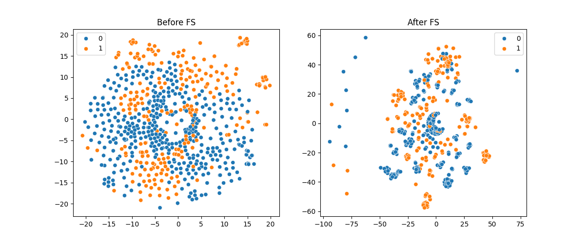

# 🛡️ SQL Injection Detection using Chi-Square Feature Selection & Machine Learning

Tái hiện thí nghiệm từ bài báo:

> **“Enhanced SQL injection detection using chi-square feature selection and machine learning classifiers”**
> Emanuel Casmiry, Neema Mduma, Ramadhani Sinde (2025)

Dự án này xây dựng một pipeline hoàn chỉnh để phát hiện SQL Injection dựa trên:

* TF-IDF Vectorization
* Chi-square Feature Selection
* 5 Machine Learning Classifiers
* Stratified 5-Fold Cross Validation
* Visualization (Grouped Bar Charts & t-SNE)

---

## 📌 Mục tiêu

Chứng minh rằng **Chi-Square Feature Selection** giúp:

* Giảm số lượng đặc trưng không quan trọng
* Tăng độ chính xác phân loại SQLi
* Cải thiện khả năng tách biệt dữ liệu trong không gian đặc trưng

---

## 📂 Cấu trúc thư mục

```
.
├── main.py
├── requirements.txt
├── README.md
└── data/
    └── SQLiV3.csv
```

---

## 🧠 Pipeline xử lý

```
Load CSV
   ↓
Data Cleaning
   ↓
Text Preprocessing
   ↓
Train/Test Split (Stratified 80/20)
   ↓
TF-IDF Vectorization (train)
   ↓
Evaluate BEFORE Feature Selection (5 models, 5-fold CV)
   ↓
Chi-Square Feature Selection (Top 500 features)
   ↓
Evaluate AFTER Feature Selection (5 models, 5-fold CV)
   ↓
Visualization (Bar charts + t-SNE)
```


---

## 🗃️ Dataset 2 bộ dữ liệu:

## 🧪 Chuẩn bị bộ dữ liệu bằng data/SQLiV3.csv
Yêu cầu cấu trúc:

| Sentence       | Label |
| -------------- | ----- |
| SQL query text | 0/1   |

* `0` → Normal query
* `1` → SQL Injection query

## 🧪 Chuẩn bị bộ dữ liệu bằng SQLMap (theo đúng phương pháp của bài báo)

Ngoài việc sử dụng file `SQLiV3.csv`, dự án này còn hỗ trợ tạo **bộ dữ liệu SQL Injection thực tế** theo đúng phương pháp mà bài báo đã thực hiện.

Trong bài báo gốc, tác giả **không sử dụng dataset có sẵn**. Thay vào đó, họ:

1. Ghi lại **input bình thường của người dùng** từ các form nhập liệu
2. Thực hiện **tấn công SQL Injection có kiểm soát** bằng SQLMap
3. Ghi log toàn bộ payload mà SQLMap sinh ra
4. Ghép hai phần này lại thành dataset có gán nhãn

Tái hiện quy trình này ngay trên máy local bằng **DVWA (Damn Vulnerable Web App)** và **SQLMap**.

---

### Bước 1 — Chạy DVWA bằng Docker

```bash
docker run -d --name dvwa -p 8080:80 vulnerables/web-dvwa:1.9
```

Mở trình duyệt:

```
http://localhost:8080
```

Đăng nhập: `admin / password`
Vào mục **SQL Injection**.

---

### Bước 2 — Sinh payload SQL Injection bằng SQLMap

Chạy trên Terminal của máy (không chạy trong Docker):

```bash
sqlmap -u "http://localhost:8080/vulnerabilities/sqli/?id=1&Submit=Submit" \
--batch --level=2 --risk=1 --technique=BEU -v 3 \
--stop=50 > sqli_payloads.txt
```

Lệnh này sẽ ghi lại các payload tấn công mà SQLMap tạo ra vào file `sqli_payloads.txt`.

---

### Bước 3 — Tạo dữ liệu input bình thường

Tạo file `normal.txt`:

```
id=1
id=2
id=admin
id=test
id=123
```

Đây là các input hợp lệ của người dùng.

---

### Bước 4 — Tạo file dataset CSV

Tạo file `build_dataset.py`:

```python
import csv

payloads = []
with open("sqli_payloads.txt") as f:
    for line in f:
        if "[PAYLOAD]" in line:
            payload = line.split("[PAYLOAD]")[-1].strip()
            payloads.append(payload)

normals = []
with open("normal.txt") as f:
    for line in f:
        normals.append(line.strip())

with open("dataset1.csv", "w", newline="") as csvfile:
    writer = csv.writer(csvfile)
    writer.writerow(["Sentence", "Label"])

    for n in normals:
        writer.writerow([n, 0])

    for p in payloads:
        writer.writerow([p, 1])

print("dataset1.csv created!")
```

Chạy:

```bash
python build_dataset.py
```

Bạn sẽ thu được file `dataset1.csv` đúng theo phương pháp mà bài báo đã mô tả:

> ghi lại input bình thường + payload do SQLMap sinh ra.

---

## 🛠️ Cài đặt môi trường

> Khuyến nghị Python **3.12**

```bash
python3.12 -m venv .venv
source .venv/bin/activate
pip install -r requirements.txt
```

---

## ▶️ Chạy chương trình

```bash
python main.py
```

Kết quả:

* In metrics BEFORE / AFTER
* Hiển thị 2 biểu đồ grouped bar chart
* Hiển thị t-SNE visualization
* Lưu file PNG vào thư mục project

---

## 🤖 Các mô hình sử dụng

| Model                   | Thư viện |
| ----------------------- | -------- |
| Multinomial Naive Bayes | sklearn  |
| Logistic Regression     | sklearn  |
| Decision Tree           | sklearn  |
| Linear SVM              | sklearn  |
| KNN                     | sklearn  |

---

## 📊 Metrics đánh giá

* Accuracy
* Precision
* Recall
* F1-Score
* False Positive Rate

Đánh giá bằng **Stratified 5-Fold Cross Validation**.

---

## 📈 Visualization

1. **Grouped Bar Chart**

   * So sánh BEFORE vs AFTER Chi-Square
2. **t-SNE Plot**

   * Trực quan hóa phân bố dữ liệu trước và sau Feature Selection


## 📊 Kết quả Visualization

### Before Chi-square Feature Selection


### After Chi-square Feature Selection


### Trực quan hoá phân bổ dữ liệu trước và sau Feature Selection

---

## 🔬 Ý nghĩa khoa học

Việc so sánh BEFORE và AFTER được thực hiện trên **cùng không gian TF-IDF ban đầu**, đảm bảo rằng sự cải thiện hiệu năng là do **Chi-Square Feature Selection**, không phải do thay đổi đặc trưng.

---

## 📎 Tham khảo

Casmiry, E., Mduma, N., & Sinde, R. (2025).
*Enhanced SQL injection detection using chi-square feature selection and machine learning classifiers.*

---

## ✅ Kết quả mong đợi

Sau khi chạy, bạn sẽ thấy:

* Accuracy tăng sau Feature Selection
* t-SNE cho thấy dữ liệu tách cụm rõ hơn
* Decision Tree và SVM đạt hiệu năng rất cao (~99%)

---

## ✍️ Ghi chú

Nếu bạn muốn mở rộng:

* Tìm top-k động thay vì cố định 500
* Lưu metrics ra CSV
* Thêm Random Forest / XGBoost
* Chạy trên dataset tự sinh bằng SQLMap

---