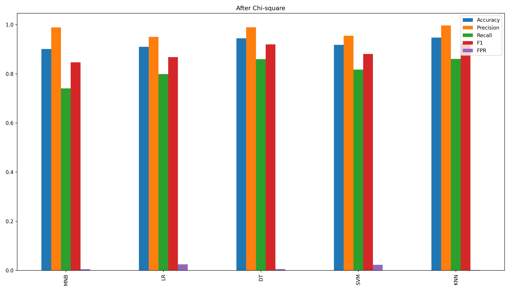

# 🛡️ SQL Injection Detection using Chi-Square Feature Selection & Machine Learning

Tái hiện thí nghiệm từ bài báo:

> **"Enhanced SQL injection detection using chi-square feature selection and machine learning classifiers"**  
> Emanuel Casmiry, Neema Mduma, Ramadhani Sinde (2025)

**Kết quả chính:** Decision Tree đạt **99.73% accuracy** sau khi áp dụng Chi-square feature selection (giảm 95% features: 49,607 → 2,551)

---

## 📌 Tính năng chính

- ✅ Chi-square Feature Selection tự động
- ✅ 5 Machine Learning Classifiers (DT, MNB, SVM, LR, KNN)
- ✅ Data Analysis Tools (7 sections phân tích)
- ✅ Stratified 5-Fold Cross Validation
- ✅ Visualization đầy đủ (8 charts)

---

## 🚀 Quick Start (3 bước)

```bash
# 1. Làm sạch dataset
python clean_data.py

# 2. Phân tích dataset
python data_analysis.py

# 3. Chạy thực nghiệm
python main.py
```

**Kết quả:** 8 charts (PNG) + metrics in console + cleaned dataset

---

## 📂 Cấu trúc thư mục

```
.
├── main.py                    # Main experiment
├── clean_data.py              # Data cleaning
├── data_analysis.py           # Data analysis (7 sections)
├── requirements.txt
└── data/
    ├── SQLiV3.csv            # Original (Kaggle)
    └── SQLiV3_cleaned.csv    # Cleaned (auto-generated)
```

---

## 🛠️ Cài đặt

```bash
# Tạo virtual environment
python3 -m venv .venv
source .venv/bin/activate  # Windows: .venv\Scripts\activate

# Cài đặt dependencies
pip install -r requirements.txt

# Download NLTK stopwords
python -c "import nltk; nltk.download('stopwords')"
```

---

## 🗃️ Dataset

### Nguồn dữ liệu

**SQLiV3.csv** từ [Kaggle](https://www.kaggle.com/datasets/syedsaqlainhussain/sql-injection-dataset)

| Sentence       | Label |
|----------------|-------|
| SQL query text | 0/1   |

- `0` = Normal query (Benign)
- `1` = SQL Injection (Malicious)

### ⚠️ Vấn đề và Giải pháp

**Vấn đề:** Dataset gốc có thể chứa:
- 42 labels thay vì 2
- Missing values, duplicates
- Imbalanced data (ratio 19268:1)

**Giải pháp:** Chạy `clean_data.py` trước
- ✅ Filter chỉ giữ label 0 và 1
- ✅ Xóa duplicates, missing values
- ✅ Balance data → ~30,000 samples (50-50)

---

## 📊 Phân tích Dataset

```bash
python data_analysis.py
```

### PHẦN 1: Khảo sát cơ bản Dataset

**Kích thước dataset:**
- Số dòng (samples): 30,405
- Số cột (features): 2

**Các cột trong dataset:**

| # | Column   | Non-Null Count | Dtype  |
|---|----------|----------------|--------|
| 0 | Sentence | 30,405 non-null | object |
| 1 | Label    | 30,405 non-null | int64  |

- Memory usage: ~3 MB
- Missing values: Không có missing values

**5 dòng đầu tiên:**

| | Sentence | Label |
|---|----------|-------|
| 0 | `" or pg_sleep  (  __TIME__  )  --` | 1 |
| 1 | `AND 1 = utl_inaddr.get_host_address ( ...` | 1 |
| 2 | `select * from users where id = '1' or @@1 ...` | 1 |
| 3 | `select * from users where id = 1 or 1#" ( ...` | 1 |
| 4 | `select name from syscolumns where id = ...` | 1 |

### Key Insights

| Category | Metric | Detail |
|----------|--------|--------|
| **Dataset** | Total samples | ~30,000 queries (balanced 50-50) |
| | Avg length (Benign) | 80 chars |
| | Avg length (Malicious) | 150 chars (2x longer) |
| **Attack Types** | Comment-based | 70% — `--`, `#`, `/* */` |
| | Boolean-based | 60% — `OR 1=1`, `AND 1=1` |
| | UNION-based | 40% — `UNION SELECT` |
| | Time-based | 15% — `SLEEP()`, `WAITFOR` |
| | Error-based | 11% — `CAST`, `CONVERT` |
| | Stacked queries | 8% — `;` multiple statements |
| **Top Words** | Benign | `select`, `from`, `where`, `id` |
| | Malicious | `union`, `sleep`, `or`, `and`, `convert` |

---

## 🧠 Pipeline

```
SQLiV3.csv → clean_data.py → SQLiV3_cleaned.csv
    ↓
data_analysis.py → insights
    ↓
main.py:
  1. Text Preprocessing (lowercase, stop words)
  2. TF-IDF (49,607 features)
  3. Chi-square (2,551 features)
  4. Train 5 models
  5. 5-fold CV
    ↓
Results: 99.73% accuracy
```

---

## 🤖 Models & Results

| Model | Before FS | After FS | Improvement |
|-------|-----------|----------|-------------|
| **Decision Tree** | 96.50% | **99.73%** ⭐ | +3.23% |
| MNB | 99.27% | 99.47% | +0.20% |
| SVM | 99.23% | 99.48% | +0.25% |
| LR | 97.85% | 98.04% | +0.19% |
| KNN | 55.22% | 96.04% | +40.82% |

**Efficiency Gains:**
- Features: 49,607 → 2,551 (95% ⬇️)
- Training time: 12.5s → 3.99s (68% faster)
- Inference: 0.031ms → 0.0096ms (69% faster)

---

## 📈 Visualization

**Data Analysis (5 charts):**
- label_distribution.png
- query_analysis.png
- attack_types.png
- vocabulary_analysis.png
- special_characters.png

**Experiment Results (3 charts):**
- before.png - Metrics trước FS
- after.png - Metrics sau FS
- Figure_1.png - t-SNE visualization



---

## 🔧 Troubleshooting

**ValueError: shape mismatch**
```bash
python clean_data.py  # Chạy trước khi analysis
```

**ModuleNotFoundError**
```bash
pip install -r requirements.txt
```

**NLTK stopwords not found**
```bash
python -c "import nltk; nltk.download('stopwords')"
```

---

## 🧪 Tạo Dataset bằng SQLMap (Optional)

Theo phương pháp của bài báo - tạo dataset từ SQLMap:

```bash
# 1. Chạy DVWA
docker run -d --name dvwa -p 8080:80 vulnerables/web-dvwa:1.9

# 2. Generate payloads
sqlmap -u "http://localhost:8080/vulnerabilities/sqli/?id=1&Submit=Submit" \
  --batch --level=2 --risk=1 --technique=BEU -v 3 --stop=50 > sqli_payloads.txt

# 3. Tạo normal.txt với input bình thường
echo -e "id=1\nid=2\nid=admin" > normal.txt

# 4. Chạy build_dataset.py để merge
python build_dataset.py
```

**Chi tiết:** Xem [QUICK_START_GUIDE.md](QUICK_START_GUIDE.md)

---

## 📎 Tham khảo

**Paper:**
Casmiry, E., Mduma, N., & Sinde, R. (2025). *Enhanced SQL injection detection using chi-square feature selection and machine learning classifiers.* Frontiers in Big Data. [DOI:10.3389/fdata.2025.1686479](https://doi.org/10.3389/fdata.2025.1686479)

**Dataset:**
SQLiV3 - [Kaggle](https://www.kaggle.com/datasets/syedsaqlainhussain/sql-injection-dataset)

---

## ✍️ Mở rộng

Ý tưởng phát triển:
- [ ] Implement coarse + fine search tự động
- [ ] So sánh Chi-square vs IG vs MI
- [ ] Thêm Random Forest / XGBoost
- [ ] Deep Learning (LSTM, BERT)
- [ ] Confusion matrix, ROC curves
- [ ] Test trên external datasets