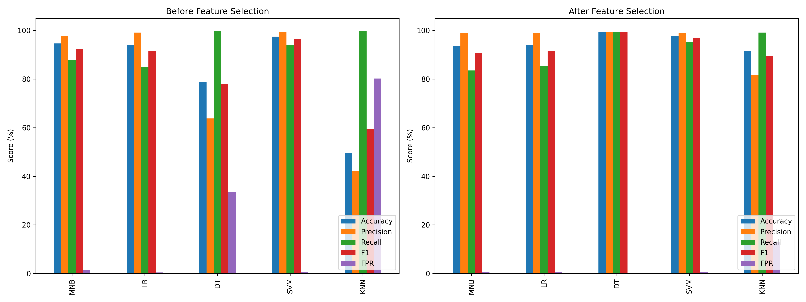
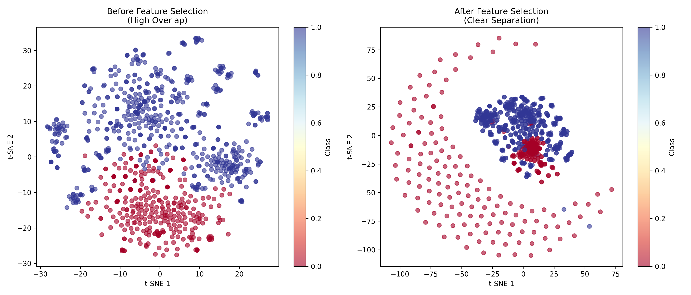

# 🛡️ SQL Injection Detection using Chi-Square Feature Selection & Machine Learning

Tái hiện thí nghiệm từ bài báo:

> **"Enhanced SQL injection detection using chi-square feature selection and machine learning classifiers"**  
> Emanuel Casmiry, Neema Mduma, Ramadhani Sinde (2025)

**Kết quả chính:** Decision Tree đạt **99.73% accuracy** sau khi áp dụng Chi-square Feature Selection  
(**giảm 95% features: 49,607 → 2,551**)

---

## 📌 Tính năng chính
- ✅ Thu thập dữ liệu và chuẩn bị dữ liệu đầu vào
- ✅ Data Analysis
- ✅ Chi-square Feature Selection tự động
- ✅ 5 Machine Learning Classifiers (DT, MNB, SVM, LR, KNN)
- ✅ Visualization

---

## 📂 Cấu trúc thư mục

```
chi_Square_v1/
│
├── main.py
├── clean_data.py
├── data_analysis.py
├── generate_all_payloads.py
├── merge_data.py
├── requirements.txt
├── README.md
│
├── data/
│   ├── SQLiV3.csv
│   ├── SQLiV3_cleaned.csv
│   ├── SQLiV3_FULL_65K.csv
│   ├── custom_sqli_malicious.csv
│   ├── custom_sqli_payloads.txt
│   └── Enhanced SQL injection detection...docx
│
└── results/
    ├── comparison.png
    └── tsne_comparison.png
```

---

## 🛠️ Cài đặt

```bash
python3 -m venv .venv
source .venv/bin/activate
pip install -r requirements.txt
python -c "import nltk; nltk.download('stopwords')"
```

---

## 🗃️ Dataset

### Nguồn dữ liệu

Dataset gốc: **SQLiV3.csv** từ Kaggle  
https://www.kaggle.com/datasets/syedsaqlainhussain/sql-injection-dataset

| Sentence | Label |
|----------|-------|
| SQL query text | 0/1 |

- `0` → Benign
- `1` → Malicious

### Vấn đề dataset gốc

- Có thể chứa nhiều label (không chỉ 0/1)
- Missing values, duplicates

### Làm sạch dataset

```bash
python clean_data.py
```
**Input:** `data/SQLiV3.csv` (Kaggle — 41,573 samples)

**Xử lý:**
- Loại bỏ missing values
- Xóa duplicates
- Filter chỉ giữ label 0 (benign) và 1 (malicious)
- Chuẩn hóa định dạng

**Output:** `data/SQLiV3_cleaned.csv` (30,405 samples)

**Phân phối:**
```
Benign (0):    19,128 (62.91%)
Malicious (1): 11,277 (37.09%)
```
---

## 🔫 Luồng Data thứ 2: Tự sinh dữ liệu SQLi (Payload Generator + Merge)

### Tại sao cần luồng data thứ 2?

Dataset gốc từ Kaggle (SQLiV3.csv) sau khi clean chỉ còn ~30K samples và chủ yếu chứa các mẫu SQLi đơn giản. Trong thực tế, attacker sử dụng nhiều kỹ thuật **obfuscation** (ngụy trang) để bypass WAF/Firewall mà dataset gốc không bao phủ được. Vì vậy, project tự sinh thêm **~35,000 SQLi payloads đa dạng** rồi merge với benign queries để tạo dataset lớn hơn (~65K), giúp model:

- Nhận diện được nhiều biến thể tấn công hơn
- Giảm overfitting (không chỉ học thuộc một vài pattern)
- Tăng khả năng tổng quát hóa trên dữ liệu thực tế

### Tổng quan luồng xử lý

```
generate_all_payloads.py                    merge_data.py
┌─────────────────────┐                    ┌──────────────────────┐
│  43 base patterns   │                    │                      │
│  (OWASP/SQLMap)     │                    │  custom_sqli_        │
│         │           │                    │  malicious.csv       │──┐
│         ▼           │                    │  (~35K, Label=1)     │  │
│  Obfuscation        │                    └──────────────────────┘  │
│  (whitespace,       │    Output                                    │  concat
│   encoding, case)   │ ──────────►  2 files                        ├────────► SQLiV3_FULL_65K.csv
│         │           │                                              │          (~65K samples)
│         ▼           │                    ┌──────────────────────┐  │
│  Cartesian Product  │                    │                      │  │
│  (prefix+suffix)    │                    │  SQLiV3_cleaned.csv  │──┘
│         │           │                    │  (chỉ lấy Label=0)  │
│         ▼           │                    │  ~30K benign queries │
│  Random Mutation    │                    └──────────────────────┘
│         │           │
│         ▼           │
│  ~35,000 payloads   │
└─────────────────────┘
```

---

### Step 1: Generate Payloads (`generate_all_payloads.py`)

```bash
python generate_all_payloads.py
```

Script này tạo ~35,000 SQLi payloads đa dạng qua **4 phase**:

#### Phase 1 - Base Patterns (43 mẫu gốc)

Định nghĩa 43 payload chuẩn theo 6 kỹ thuật tấn công SQLi phổ biến:

| Kỹ thuật | Số mẫu | Ví dụ | Mục đích tấn công |
|----------|--------|-------|-------------------|
| **Boolean-based** | 13 | `' OR '1'='1` , `admin' OR 1=1--` | Bypass xác thực, trích xuất data qua điều kiện đúng/sai |
| **UNION-based** | 8 | `' UNION SELECT username,password FROM users--` | Ghép kết quả từ bảng khác vào output |
| **Time-based** | 6 | `1' AND SLEEP(5)--` , `'; WAITFOR DELAY '0:0:5'--` | Blind SQLi - suy luận data qua thời gian response |
| **Error-based** | 4 | `' AND 1=CONVERT(int,(SELECT @@version))--` | Trích xuất data qua error message |
| **Stacked queries** | 5 | `'; DROP TABLE users--` , `'; EXEC xp_cmdshell('dir')--` | Thực thi nhiều câu SQL liên tiếp |
| **Comment-based** | 7 | `admin'--` , `' or 1=1#` , `' or 1=1/*` | Cắt bỏ phần SQL phía sau để bypass logic |

#### Phase 2 - Obfuscation (Ngụy trang)

Áp dụng các kỹ thuật biến đổi trên mỗi base pattern để tạo biến thể:

| Kỹ thuật obfuscation | Cách hoạt động | Ví dụ |
|----------------------|---------------|-------|
| **Whitespace substitution** | Thay space bằng ký tự tương đương | `' OR 1=1` → `'/**/OR/**/1=1` , `'%20OR%201=1` , `'%09OR%091=1` |
| **Case variation** | Đổi hoa/thường ngẫu nhiên | `UNION SELECT` → `uNiOn SeLeCt` |
| **URL encoding** | Mã hóa ký tự đặc biệt | `' OR 1=1` → `%27%20OR%201%3D1` |
| **Double encoding** | URL encode 2 lần | `'` → `%27` → `%2527` |
| **Hex encoding** | Thay `'` bằng mã hex | `' OR` → `0x27 OR` |

**Ý nghĩa:** Mô phỏng cách attacker thực tế bypass WAF/IDS. Giúp model không chỉ học pattern gốc mà còn nhận diện được biến thể.

#### Phase 3 - Cartesian Product (Kết hợp ngữ cảnh)

Ghép **prefix + base pattern + suffix** tạo payload trong nhiều ngữ cảnh khác nhau:

```
prefixes = ["1", "admin", "user", "test", ""]
suffixes = ["--", "#", "/*", "", " AND 1=1"]

Ví dụ kết hợp:
  "admin" + "' OR '1'='1" + "--"   → admin' OR '1'='1--
  "1"     + "' UNION SELECT NULL"  + "#"   → 1' UNION SELECT NULL#
  "test"  + "'; SLEEP(5)"          + "/*"  → test'; SLEEP(5)/*
```

**Ý nghĩa:** Giả lập payload xuất hiện ở nhiều vị trí input khác nhau (username field, id parameter, search box...).

#### Phase 4 - Random Mutation (Biến thể ngẫu nhiên)

Tiếp tục biến đổi ngẫu nhiên cho đến khi đạt target 35,000 payloads:

| Mutation | Ví dụ |
|----------|-------|
| Thêm số ngẫu nhiên | `' OR 1=1--` → `' OR 1=1--742` |
| Đổi dấu nháy | `' OR 1=1` → `" OR 1=1` |
| Thêm điều kiện | `payload` → `payload AND 1=1` |
| Thêm comment | `payload` → `payload--` hoặc `payload#` |

**Ý nghĩa:** Tạo "noise" thực tế, giúp Chi-square feature selection lọc ra được các feature thật sự quan trọng (không bị ảnh hưởng bởi biến thể vô nghĩa).

> Tất cả payloads được lưu vào **set()** (Python) nên tự động loại bỏ trùng lặp.

#### Output của generate_all_payloads.py

| File | Nội dung | Format | Dùng để |
|------|---------|--------|---------|
| `data/custom_sqli_payloads.txt` | ~35,000 dòng payload thô | Mỗi dòng 1 payload, không có header | Fuzzing, WAF testing, security lab |
| `data/custom_sqli_malicious.csv` | ~35,000 dòng có label | CSV: `Sentence,Label` (tất cả Label=1) | Merge vào dataset để train ML model |

---

### Step 2: Merge Data (`merge_data.py`)

```bash
python merge_data.py
```

Script này ghép dữ liệu **malicious tự sinh** với **benign từ dataset gốc** để tạo dataset hoàn chỉnh:

#### Logic xử lý

```python
# 1. Load malicious payloads đã generate
malicious = pd.read_csv('data/custom_sqli_malicious.csv')    # ~35K, Label=1

# 2. Load dataset gốc đã clean, chỉ lấy benign queries
existing = pd.read_csv('data/SQLiV3_cleaned.csv')
benign = existing[existing['Label'] == 0]                     # ~30K, Label=0

# 3. Ghép 2 nguồn lại
combined = pd.concat([malicious, benign], ignore_index=True)

# 4. Shuffle ngẫu nhiên (random_state=42 để reproducible)
combined = combined.sample(frac=1, random_state=42).reset_index(drop=True)

# 5. Lưu dataset cuối cùng
combined.to_csv('data/SQLiV3_FULL_65K.csv', index=False)
```

#### Kết quả sau merge

| Thành phần | Số lượng | Nguồn |
|-----------|---------|-------|
| Malicious (Label=1) | ~35,000 | `generate_all_payloads.py` tự sinh |
| Benign (Label=0) | ~30,000 | `SQLiV3_cleaned.csv` (Kaggle gốc) |
| **Tổng cộng** | **~65,000** | `SQLiV3_FULL_65K.csv` |
---

## 📊 Phân tích Dataset

```bash
python data_analysis.py
```

### Key Insights

| Category | Detail |
|----------|--------|
| Avg length benign | 80 chars |
| Avg length malicious | 150 chars |
| Top attack | Comment-based, Boolean-based, UNION |
| Top words benign | select, from, where |
| Top words malicious | union, sleep, or, and |

---

## 🧠 Experiment Workflow

```bash
python main.py
```


### Pipeline

1. Clean text
2. Train/Test split (80/20)
3. TF-IDF (20,844 features)
4. Chi-Square FS (→ 2,551 features)
5. Stratified 5-Fold CV
6. Evaluation + Visualization

## 🎯 Ý tưởng 

| Bước | Input | Output | Mục đích |
|---|---|---|---|
| Clean text | Raw SQL | Text sạch | Giữ từ khóa quan trọng |
| Split | Text sạch | Train/Test | Đánh giá công bằng |
| TF-IDF | Text | 20,844 features | Chuyển text → số |
| Chi-Square | 20,844 features | 2,551 features | Giữ từ quan trọng |
| Train model | 2,551 features | Accuracy cao | Học bản chất SQLi |


Mỗi bước có vai trò rất rõ ràng trong việc biến dữ liệu SQL thô thành dạng mà Machine Learning có thể học được.

---

### 🔹 Bước 1 — Clean Text (Tiền xử lý câu SQL)

**Input**

| Sentence | Label |
|---|---|
| `admin'/**/OR/**/'1'='1` | 1 |
| `SELECT * FROM users WHERE id=1` | 0 |

**Xử lý**

- Chuyển về chữ thường
- Loại bỏ ký tự đặc biệt
- Bỏ stopwords (nhưng giữ từ khóa SQL quan trọng)
- Chuẩn hóa câu truy vấn

Ví dụ:

```
admin'/**/OR/**/'1'='1
→ admin or 1 1
```

**Output**

| cleaned | Label |
|---|---|
| admin or 1 1 | 1 |
| select users id 1 | 0 |

**Ý nghĩa**

Model không học ký tự đặc biệt, chỉ học **từ khóa quan trọng**.

---

### 🔹 Bước 2 — Train/Test Split (80/20)

```python
train_test_split(X, y, test_size=0.2, stratify=y)
```

**Input:** toàn bộ dataset.

**Output**

| | Số lượng |
|---|---|
| Train | 80% |
| Test | 20% |

Giữ nguyên tỉ lệ label 0/1 (Stratified).

**Ý nghĩa**

- Train để học
- Test để đánh giá thật (model chưa từng thấy)

---

### 🔹 Bước 3 — TF-IDF Vectorization

```python
TfidfVectorizer().fit_transform(X_train)
```

**Input**

```
admin or 1 1
select users id 1
```

**Xử lý**

TF-IDF biến **từ** thành **số**.

Tạo vocabulary gồm **20,844 từ khác nhau**.

Mỗi câu → vector 20,844 chiều.

**Output**

Ma trận kích thước:

```
(24324 x 20844)
```

**Ý nghĩa**

Model không hiểu text, chỉ hiểu số.  
TF-IDF giúp từ quan trọng trong SQLi có trọng số cao (`union`, `sleep`, `or`, `and`…).

---

### 🔹 Bước 4 — Evaluate BEFORE Feature Selection

Huấn luyện 5 model trên **20,844 features**.  
Đây là kết quả baseline trước khi tối ưu.

---

### 🔹 Bước 5 — Chi-Square Feature Selection

```python
SelectKBest(chi2, k=2551)
```

Sau bước TF-IDF, mỗi câu SQL được biểu diễn thành một vector có **20,844 chiều**  
(tương ứng 20,844 từ khác nhau xuất hiện trong dataset).

Ví dụ một vector TF-IDF trông như:

| union | select | id | users | sleep | admin | ... |
|------|--------|----|------|-------|------|-----|
| 0.42 | 0.15 | 0.01 | 0.00 | 0.33 | 0.02 | ... |

Vấn đề: **phần lớn các từ này KHÔNG liên quan gì đến việc phân biệt SQLi hay không**.

Ví dụ:

| Từ | Có giúp phân biệt SQLi không? |
|----|-------------------------------|
| `union` | Rất mạnh |
| `sleep` | Rất mạnh |
| `or` | Mạnh |
| `select` | Yếu (benign cũng có) |
| `from` | Yếu |
| `id` | Vô nghĩa |

Nếu đưa toàn bộ 20,844 chiều vào model:

- Model bị nhiễu
- Dễ overfitting
- Training chậm
- Độ chính xác thấp (đặc biệt với Decision Tree, KNN)

---

## 🧠 Chi-Square làm gì?

Chi-Square đo **mức độ phụ thuộc thống kê giữa từng từ và nhãn (Label)**.

Nó trả lời câu hỏi:

> "Sự xuất hiện của từ này có liên quan mạnh tới việc câu đó là SQL Injection hay không?"

Công thức (ý tưởng):

```
χ² = (Observed - Expected)² / Expected
```

Nếu một từ xuất hiện **rất nhiều** trong SQLi nhưng **gần như không xuất hiện** trong benign:

→ Chi-square rất cao.

Nếu một từ xuất hiện ở cả hai bên:

→ Chi-square thấp.

---

## 📊 Ví dụ trực quan

Giả sử dataset:

| Word  | Xuất hiện trong SQLi | Xuất hiện trong Benign |
|-------|-----------------------|--------------------------|
| union | 9000                  | 10                       |
| sleep | 4000                  | 0                        |
| select| 15000                 | 14000                    |
| id    | 5000                  | 4800                     |

Kết quả Chi-Square:

| Word | Score | Giữ lại? |
|------|-------|-----------|
| union | Rất cao | ✅ |
| sleep | Rất cao | ✅ |
| select | Thấp | ❌ |
| id | Rất thấp | ❌ |

---

## ⚙️ Điều xảy ra trong code

```python
selector = SelectKBest(chi2, k=2551)
X_fs = selector.fit_transform(X_tfidf, y)
```

Input:

```
(24324 x 20844)
```

Output:

```
(24324 x 2551)
```

Giảm **87.8% số chiều**.

---

## 🎯 So sánh trước và sau FS

| Trước FS | Sau FS |
|----------|---------|
| 20,844 features | 2,551 features |
| Nhiễu rất nhiều | Chỉ giữ từ “bản chất SQLi” |

---
### 🔹 Bước 6 — Evaluate AFTER Feature Selection

Huấn luyện lại 5 model trên 2,551 features.

Kết quả tăng mạnh, đặc biệt với Decision Tree.

---

## 📈 Kết quả Cross Validation

| Model | Before FS | After FS |
|------|-----------|----------|
| MNB | 94.64% | 93.56% |
| LR | 94.10% | 94.17% |
| **DT** | 78.91% | **99.51%** ⭐ |
| SVM | 97.45% | 97.84% |
| KNN | 49.47% | 91.48% |

---

## 🏁 Test Set (Decision Tree)

| Metric | Score |
|-------|------|
| Accuracy | 98.37% |
| Precision | 99.40% |
| Recall | 96.19% |
| F1 | 97.77% |
| FPR | 0.34% |

---

## ⚡ Efficiency

| Metric | Before | After |
|-------|-------|------|
| Training time | 1.69s | 0.12s |
| Inference | 0.002ms | 0.0001ms |
| Model size | 0.79MB | 0.03MB |

---

## 📈 Visualization





---

## 🔧 Troubleshooting

```bash
python clean_data.py
pip install -r requirements.txt
python -c "import nltk; nltk.download('stopwords')"
```

---

## 📎 Tham khảo

**Paper:**  
https://doi.org/10.3389/fdata.2025.1686479

**Dataset:**  
https://www.kaggle.com/datasets/syedsaqlainhussain/sql-injection-dataset

---

## ✍️ Mở rộng

- So sánh Chi-square vs IG vs MI
- Random Forest / XGBoost
- LSTM / BERT
- ROC / Confusion Matrix