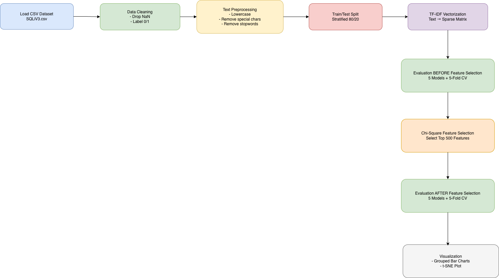

Dưới đây là nội dung **`README.md`** chuẩn chỉnh để bạn đặt ngay trong project. Nội dung bám sát code, sơ đồ pipeline, và cách chạy thực tế.

Bạn chỉ cần tạo file `README.md` và paste vào.

---

# 🛡️ SQL Injection Detection using Chi-Square Feature Selection & Machine Learning

Tái hiện thí nghiệm từ bài báo:

> **“Enhanced SQL injection detection using chi-square feature selection and machine learning classifiers”**
> Emanuel Casmiry, Neema Mduma, Ramadhani Sinde (2025)

Dự án này xây dựng một pipeline hoàn chỉnh để phát hiện SQL Injection dựa trên:

* TF-IDF Vectorization
* Chi-square Feature Selection
* 5 Machine Learning Classifiers
* Stratified 5-Fold Cross Validation
* Visualization (Grouped Bar Charts & t-SNE)

---

## 📌 Mục tiêu

Chứng minh rằng **Chi-Square Feature Selection** giúp:

* Giảm số lượng đặc trưng không quan trọng
* Tăng độ chính xác phân loại SQLi
* Cải thiện khả năng tách biệt dữ liệu trong không gian đặc trưng

---

## 📂 Cấu trúc thư mục

```
.
├── main.py
├── requirements.txt
├── README.md
└── data/
    └── SQLiV3.csv
```

---

## 🧠 Pipeline xử lý

```
Load CSV
   ↓
Data Cleaning
   ↓
Text Preprocessing
   ↓
Train/Test Split (Stratified 80/20)
   ↓
TF-IDF Vectorization (train)
   ↓
Evaluate BEFORE Feature Selection (5 models, 5-fold CV)
   ↓
Chi-Square Feature Selection (Top 500 features)
   ↓
Evaluate AFTER Feature Selection (5 models, 5-fold CV)
   ↓
Visualization (Bar charts + t-SNE)
```


⚠️ Quan trọng: Đây là **sequential experiment**, không phải hai nhánh song song.

---

## 🗃️ Dataset

Sử dụng file:

```
data/SQLiV3.csv
```

Yêu cầu cấu trúc:

| Sentence       | Label |
| -------------- | ----- |
| SQL query text | 0/1   |

* `0` → Normal query
* `1` → SQL Injection query

---

## 🛠️ Cài đặt môi trường

> Khuyến nghị Python **3.12**

```bash
python3.12 -m venv .venv
source .venv/bin/activate
pip install -r requirements.txt
```

---

## ▶️ Chạy chương trình

```bash
python main.py
```

Kết quả:

* In metrics BEFORE / AFTER
* Hiển thị 2 biểu đồ grouped bar chart
* Hiển thị t-SNE visualization
* Lưu file PNG vào thư mục project

---

## 🤖 Các mô hình sử dụng

| Model                   | Thư viện |
| ----------------------- | -------- |
| Multinomial Naive Bayes | sklearn  |
| Logistic Regression     | sklearn  |
| Decision Tree           | sklearn  |
| Linear SVM              | sklearn  |
| KNN                     | sklearn  |

---

## 📊 Metrics đánh giá

* Accuracy
* Precision
* Recall
* F1-Score
* False Positive Rate

Đánh giá bằng **Stratified 5-Fold Cross Validation**.

---

## 📈 Visualization

1. **Grouped Bar Chart**

   * So sánh BEFORE vs AFTER Chi-Square
2. **t-SNE Plot**

   * Trực quan hóa phân bố dữ liệu trước và sau Feature Selection

---

## 🔬 Ý nghĩa khoa học

Việc so sánh BEFORE và AFTER được thực hiện trên **cùng không gian TF-IDF ban đầu**, đảm bảo rằng sự cải thiện hiệu năng là do **Chi-Square Feature Selection**, không phải do thay đổi đặc trưng.

---

## 📎 Tham khảo

Casmiry, E., Mduma, N., & Sinde, R. (2025).
*Enhanced SQL injection detection using chi-square feature selection and machine learning classifiers.*

---

## ✅ Kết quả mong đợi

Sau khi chạy, bạn sẽ thấy:

* Accuracy tăng sau Feature Selection
* t-SNE cho thấy dữ liệu tách cụm rõ hơn
* Decision Tree và SVM đạt hiệu năng rất cao (~99%)

---

## ✍️ Ghi chú

Nếu bạn muốn mở rộng:

* Tìm top-k động thay vì cố định 500
* Lưu metrics ra CSV
* Thêm Random Forest / XGBoost
* Chạy trên dataset tự sinh bằng SQLMap

---

Happy hacking & researching! 🚀